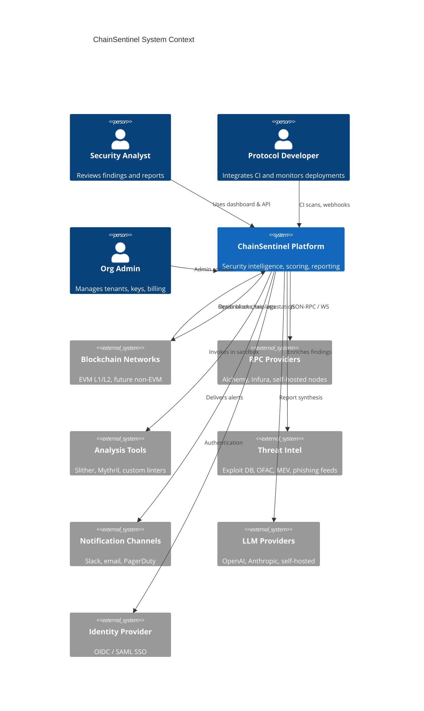
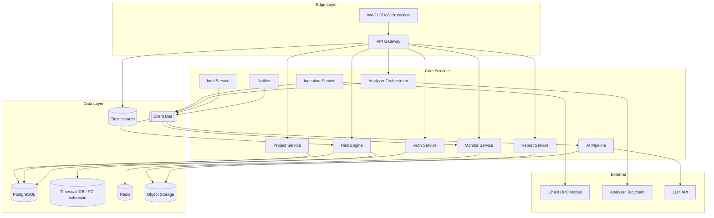

# 2. System Architecture

**Document:** ChainSentinel Platform Architecture  
**Version:** 1.0.0

---

## 2.1 System Context

ChainSentinel sits between **blockchain networks**, **security tooling ecosystems**, and **customer security operations teams**. It ingests chain data and source artifacts, produces normalized findings, computes risk scores, generates reports, and delivers alerts.



---

## 2.2 Logical Architecture (C4 Container)



---

## 2.3 Core Data Flows

### 2.3.1 Static Analysis Flow

```
Developer/CI → API Gateway → Analyzer Orchestrator
    → Sandbox Worker (Slither/Mythril/Custom)
    → Finding Normalizer
    → PostgreSQL (findings, scans)
    → Event: cs.scan.completed.v1
    → Risk Engine (re-score)
    → Monitor Service (rule evaluation)
    → Notifier (if thresholds breached)
```

### 2.3.2 On-Chain Monitoring Flow

```
Block Listener → Tx Decoder → Log Indexer
    → Event: cs.chain.tx.observed.v1 / cs.chain.log.observed.v1
    → Monitor Service (real-time rules + intel enrichment)
    → Event: cs.alert.triggered.v1
    → Notifier + Risk Engine (behavioral dimension update)
```

### 2.3.3 Report Generation Flow

```
User/API → Report Service (create report job)
    → Event: cs.report.requested.v1
    → AI Pipeline:
        1. Gather artifacts (findings, scores, contract metadata)
        2. RAG retrieval (CVE, past audits, protocol docs)
        3. Section generation with guardrails
        4. Human review queue (optional)
    → PDF/HTML render → S3
    → Optional: Attestation Anchor (content hash on-chain)
    → Event: cs.report.completed.v1
```

---

## 2.4 Service Responsibilities

| Service | Responsibility | Scaling Model |
|---------|----------------|---------------|
| **API Gateway** | Routing, rate limiting, request validation, OpenAPI | Horizontal, stateless |
| **Auth Service** | Users, orgs, RBAC, API keys, SSO | Horizontal, stateless |
| **Project Service** | Projects, deployments, contract metadata | Horizontal |
| **Ingestion** | Chain sync, decode, normalize chain events | Partition by chain_id |
| **Analyzer Orchestrator** | Scan DAG, sandbox lifecycle, result aggregation | Queue-driven workers |
| **Risk Engine** | Score computation, calibration, explainability | CPU-bound workers |
| **Intel Service** | Feed ingestion, address/selector blocklists | Scheduled + streaming |
| **Monitor Service** | Alert rule engine, deduplication, suppression | Low-latency, Redis-backed |
| **Report Service** | Report CRUD, rendering, attestation coordination | Async workers |
| **AI Pipeline** | LLM calls, RAG, output validation | GPU optional; rate-limited |
| **Notifier** | Multi-channel delivery, retry, delivery receipts | Queue consumers |

---

## 2.5 Event Bus Topology

**Recommended:** Apache Kafka (production) or NATS JetStream (lighter deployments).

| Topic | Producer | Consumer(s) | Payload Summary |
|-------|----------|-------------|-----------------|
| `cs.scan.requested.v1` | API Gateway | Analyzer Orchestrator | scan_id, deployment_id, tools[] |
| `cs.scan.completed.v1` | Analyzer Orchestrator | Risk Engine, Monitor | scan_id, finding_count, status |
| `cs.finding.created.v1` | Normalizer | Risk Engine, ES indexer | normalized finding |
| `cs.chain.tx.observed.v1` | Ingestion | Monitor, Risk Engine | tx metadata, decoded calls |
| `cs.chain.log.observed.v1` | Ingestion | Monitor | event signature, args |
| `cs.alert.triggered.v1` | Monitor | Notifier, Report Service | alert_id, severity |
| `cs.risk.score.updated.v1` | Risk Engine | Monitor, API (SSE), ES | score snapshot |
| `cs.report.requested.v1` | Report Service | AI Pipeline | report_id, template, scope |
| `cs.report.completed.v1` | AI Pipeline | Notifier | report_id, s3_uri |
| `cs.intel.feed.updated.v1` | Intel Service | Monitor, Risk Engine | feed_version |

All events carry: `event_id`, `occurred_at`, `org_id`, `trace_id`, `schema_version`.

---

## 2.6 Multi-Tenancy Model

```
Organization (tenant root)
  └── Projects (1..N)
        └── Deployments (contract instances)
              └── Scans, Findings, Scores, Alerts, Reports
```

**Isolation guarantees:**

- Row-level security (RLS) on PostgreSQL keyed by `org_id`
- S3 prefix: `s3://cs-artifacts/{org_id}/{project_id}/...`
- API keys scoped to org + optional project ACL
- Separate Redis key namespaces per org for rate limits and alert state

---

## 2.7 Security Architecture

### 2.7.1 Trust Zones

| Zone | Components | Controls |
|------|------------|----------|
| **Public** | API Gateway, WAF | TLS 1.3, OWASP rules, bot detection |
| **Application** | All services | mTLS service mesh, OIDC service accounts |
| **Analysis Sandbox** | Analyzer workers | gVisor/Firecracker, no outbound network, ephemeral |
| **Data** | PostgreSQL, S3, Redis | Encryption at rest (KMS), private subnets |
| **Secrets** | Vault / AWS Secrets Manager | Dynamic credentials, rotation |

### 2.7.2 Analyzer Sandbox

Untrusted code (customer contracts, third-party analyzers) runs in isolated environments:

- No access to production DB credentials
- Results exported via signed object references only
- Resource limits: CPU, memory, wall-clock timeout
- Network egress deny-by-default

### 2.7.3 Audit Trail

All mutating API calls and admin actions append to `audit_logs` (append-only, WORM-capable storage for compliance tier).

---

## 2.8 Observability

| Pillar | Stack | Key Signals |
|--------|-------|-------------|
| **Metrics** | Prometheus + Grafana | Scan latency p99, alert delivery rate, RPC error rate |
| **Logs** | Structured JSON → Loki/ELK | Correlation via `trace_id` |
| **Traces** | OpenTelemetry → Tempo/Jaeger | End-to-end scan and report pipelines |
| **SLOs** | Error budgets | API availability 99.9%, alert delivery < 60s p95 |

---

## 2.9 Deployment Topology

### Production (Kubernetes)

```
┌─────────────────────────────────────────────────────────┐
│  Region A (Primary)                                      │
│  ┌─────────┐  ┌─────────┐  ┌─────────┐  ┌─────────┐   │
│  │ API (3+)│  │ Workers │  │ Ingest  │  │ AI Pool │   │
│  └────┬────┘  └────┬────┘  └────┬────┘  └────┬────┘   │
│       └────────────┴────────────┴────────────┘         │
│                         │                               │
│              ┌──────────┴──────────┐                   │
│              │ RDS PostgreSQL (HA) │                   │
│              │ MSK Kafka           │                   │
│              │ ElastiCache Redis   │                   │
│              └─────────────────────┘                   │
└─────────────────────────────────────────────────────────┘
         │
         │ async replication (DR)
         ▼
┌─────────────────────────────────────────────────────────┐
│  Region B (DR — read replica, failover standby)         │
└─────────────────────────────────────────────────────────┘
```

### Development

Docker Compose stack: PostgreSQL, Redis, NATS, MinIO, mock RPC, single-node services.

---

## 2.10 Chain Adapter Pattern

All chain-specific logic implements `ChainAdapter`:

```
ChainAdapter
├── GetBlock(number) → Block
├── GetTransaction(hash) → Tx
├── DecodeTransaction(tx, abi) → DecodedCall[]
├── SubscribeBlocks() → Stream<Block>
├── GetCode(address) → bytecode
└── GetStorageAt(address, slot) → bytes32
```

**Phase 1:** EVM adapter (Ethereum, Arbitrum, Base, Polygon).  
**Phase 3+:** Solana, Cosmos SDK adapters behind same interface.

---

## 2.11 Failure Modes & Resilience

| Failure | Mitigation |
|---------|------------|
| RPC provider outage | Multi-provider failover pool; cached block height |
| Analyzer timeout | Partial results + retry with backoff; scan status `degraded` |
| Kafka lag | Auto-scale consumers; priority queue for paid tiers |
| LLM rate limit | Queue + fallback to template-only report |
| DB connection exhaustion | PgBouncer; read replicas for analytics queries |

---

## 2.12 Related Documents

- [Database Schema](./03-database-schema.md)
- [API Endpoints](./04-api-endpoints.md)
- [Risk Scoring Engine](./06-risk-scoring-engine.md)
