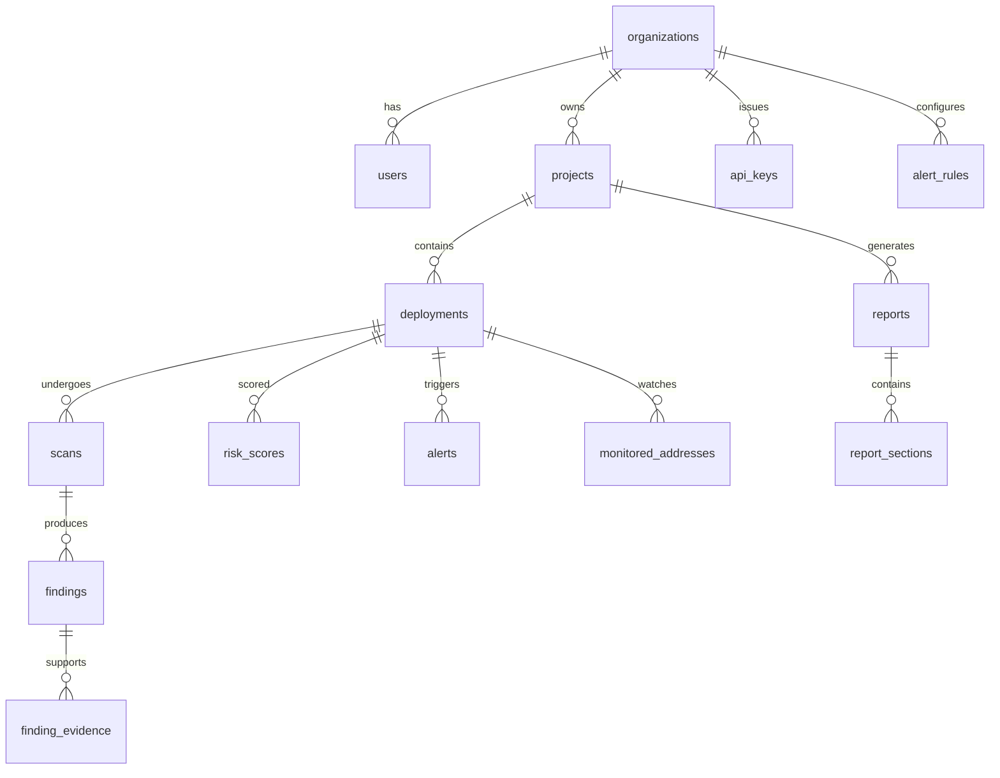

# 3. Database Schema

**Document:** ChainSentinel Data Model  
**Version:** 1.0.0  
**Primary Store:** PostgreSQL 16+ with TimescaleDB extension for time-series

---

## 3.1 Design Principles

1. **Normalized core, denormalized read paths** — Canonical entities in PostgreSQL; Elasticsearch for full-text search on findings and reports.
2. **Immutable scan artifacts** — Scans and raw analyzer output are append-only; corrections create new scan records linked via `supersedes_scan_id`.
3. **Tenant isolation** — Every tenant-scoped table includes `org_id`; PostgreSQL RLS policies enforce access.
4. **Temporal risk data** — Risk scores stored as time-series hypertables for trend analysis.
5. **UUID primary keys** — All PKs are UUIDv7 (time-sortable) unless noted.

---

## 3.2 Entity Relationship Overview



---

## 3.3 Core Tables

### 3.3.1 `organizations`

| Column | Type | Constraints | Description |
|--------|------|-------------|-------------|
| id | UUID | PK | Tenant identifier |
| name | VARCHAR(255) | NOT NULL | Display name |
| slug | VARCHAR(63) | UNIQUE, NOT NULL | URL-safe identifier |
| plan_tier | ENUM | NOT NULL | `free`, `pro`, `enterprise` |
| settings | JSONB | DEFAULT '{}' | Feature flags, retention overrides |
| created_at | TIMESTAMPTZ | NOT NULL | |
| updated_at | TIMESTAMPTZ | NOT NULL | |
| deleted_at | TIMESTAMPTZ | NULL | Soft delete |

**Indexes:** `UNIQUE(slug)`, `idx_orgs_plan_tier`

---

### 3.3.2 `users`

| Column | Type | Constraints | Description |
|--------|------|-------------|-------------|
| id | UUID | PK | |
| org_id | UUID | FK → organizations, NOT NULL | |
| email | VARCHAR(320) | NOT NULL | |
| display_name | VARCHAR(255) | | |
| role | ENUM | NOT NULL | `owner`, `admin`, `analyst`, `viewer` |
| auth_provider | VARCHAR(50) | | `local`, `oidc`, `saml` |
| external_subject | VARCHAR(255) | | IdP subject ID |
| last_login_at | TIMESTAMPTZ | | |
| created_at | TIMESTAMPTZ | NOT NULL | |
| updated_at | TIMESTAMPTZ | NOT NULL | |

**Indexes:** `UNIQUE(org_id, email)`, `idx_users_external_subject`

---

### 3.3.3 `api_keys`

| Column | Type | Constraints | Description |
|--------|------|-------------|-------------|
| id | UUID | PK | |
| org_id | UUID | FK, NOT NULL | |
| name | VARCHAR(255) | NOT NULL | Human label |
| key_prefix | VARCHAR(12) | NOT NULL | First chars for identification |
| key_hash | BYTEA | NOT NULL | bcrypt/argon2 hash of secret |
| scopes | TEXT[] | NOT NULL | e.g. `{scans:write, reports:read}` |
| project_ids | UUID[] | | NULL = org-wide |
| expires_at | TIMESTAMPTZ | | |
| last_used_at | TIMESTAMPTZ | | |
| revoked_at | TIMESTAMPTZ | | |
| created_at | TIMESTAMPTZ | NOT NULL | |

**Indexes:** `idx_api_keys_org_id`, `idx_api_keys_prefix`

---

### 3.3.4 `projects`

| Column | Type | Constraints | Description |
|--------|------|-------------|-------------|
| id | UUID | PK | |
| org_id | UUID | FK, NOT NULL | |
| name | VARCHAR(255) | NOT NULL | |
| description | TEXT | | |
| tags | TEXT[] | DEFAULT '{}' | |
| default_chain_ids | INT[] | | Preferred chains |
| settings | JSONB | DEFAULT '{}' | Alert defaults, scan config |
| created_at | TIMESTAMPTZ | NOT NULL | |
| updated_at | TIMESTAMPTZ | NOT NULL | |
| archived_at | TIMESTAMPTZ | | |

**Indexes:** `idx_projects_org_id`, `GIN(tags)`

---

### 3.3.5 `deployments`

Represents a monitored contract instance on a specific chain.

| Column | Type | Constraints | Description |
|--------|------|-------------|-------------|
| id | UUID | PK | |
| org_id | UUID | FK, NOT NULL | Denormalized for RLS |
| project_id | UUID | FK → projects, NOT NULL | |
| chain_id | INT | NOT NULL | EIP-155 chain ID |
| address | BYTEA | NOT NULL | 20-byte address |
| address_checksum | VARCHAR(42) | NOT NULL | EIP-55 checksummed |
| name | VARCHAR(255) | | Friendly name |
| contract_type | ENUM | | `proxy`, `implementation`, `standalone`, `factory` |
| proxy_admin | BYTEA | | If upgradeable |
| implementation_address | BYTEA | | Resolved impl if proxy |
| abi_hash | BYTEA | | keccak256 of canonical ABI JSON |
| source_repo_url | VARCHAR(2048) | | Git remote |
| source_commit | VARCHAR(64) | | Pin for reproducible scans |
| verified_on_explorer | BOOLEAN | DEFAULT false | |
| metadata | JSONB | DEFAULT '{}' | Compiler version, optimizer, license |
| created_at | TIMESTAMPTZ | NOT NULL | |
| updated_at | TIMESTAMPTZ | NOT NULL | |

**Indexes:** `UNIQUE(project_id, chain_id, address)`, `idx_deployments_chain_address`

---

### 3.3.6 `scans`

| Column | Type | Constraints | Description |
|--------|------|-------------|-------------|
| id | UUID | PK | |
| org_id | UUID | FK, NOT NULL | |
| deployment_id | UUID | FK → deployments, NOT NULL | |
| scan_type | ENUM | NOT NULL | `static`, `dynamic`, `manual`, `ci` |
| status | ENUM | NOT NULL | `pending`, `running`, `completed`, `failed`, `degraded` |
| tools | TEXT[] | NOT NULL | Tools invoked |
| trigger | ENUM | | `api`, `schedule`, `webhook`, `chain_event` |
| supersedes_scan_id | UUID | FK → scans | Prior scan replaced |
| source_snapshot_uri | VARCHAR(2048) | | S3 path to source tarball |
| raw_output_uri | VARCHAR(2048) | | S3 path to raw tool output |
| content_hash | BYTEA | NOT NULL | SHA-256 of normalized findings set |
| started_at | TIMESTAMPTZ | | |
| completed_at | TIMESTAMPTZ | | |
| error_message | TEXT | | |
| created_at | TIMESTAMPTZ | NOT NULL | |

**Indexes:** `idx_scans_deployment_id`, `idx_scans_status`, `idx_scans_content_hash`

---

### 3.3.7 `findings`

Normalized security issues across all analyzers.

| Column | Type | Constraints | Description |
|--------|------|-------------|-------------|
| id | UUID | PK | |
| org_id | UUID | FK, NOT NULL | |
| scan_id | UUID | FK → scans, NOT NULL | |
| deployment_id | UUID | FK, NOT NULL | Denormalized |
| fingerprint | VARCHAR(64) | NOT NULL | Stable hash for dedup across scans |
| title | VARCHAR(512) | NOT NULL | |
| description | TEXT | NOT NULL | |
| severity | ENUM | NOT NULL | `critical`, `high`, `medium`, `low`, `informational` |
| confidence | ENUM | NOT NULL | `confirmed`, `likely`, `possible`, `informational` |
| category | VARCHAR(100) | NOT NULL | SWC/CWE-aligned category |
| swc_id | VARCHAR(20) | | e.g. `SWC-107` |
| cwe_id | INT | | |
| location | JSONB | NOT NULL | `{file, line, function, contract}` |
| source_tool | VARCHAR(50) | NOT NULL | `slither`, `mythril`, `custom` |
| source_rule_id | VARCHAR(255) | | Original rule identifier |
| status | ENUM | NOT NULL | `open`, `acknowledged`, `mitigated`, `false_positive`, `wont_fix` |
| status_changed_by | UUID | FK → users | |
| status_changed_at | TIMESTAMPTZ | | |
| remediation_hint | TEXT | | |
| metadata | JSONB | DEFAULT '{}' | Tool-specific extras |
| created_at | TIMESTAMPTZ | NOT NULL | |
| updated_at | TIMESTAMPTZ | NOT NULL | |

**Indexes:** `UNIQUE(deployment_id, fingerprint)`, `idx_findings_severity`, `idx_findings_status`, `GIN(to_tsvector('english', title || ' ' || description))`

---

### 3.3.8 `finding_evidence`

Supporting artifacts for a finding (traces, PoC references, on-chain tx).

| Column | Type | Constraints | Description |
|--------|------|-------------|-------------|
| id | UUID | PK | |
| finding_id | UUID | FK → findings, NOT NULL | |
| evidence_type | ENUM | NOT NULL | `code_snippet`, `trace`, `tx_hash`, `storage_proof`, `external_ref` |
| content | JSONB | NOT NULL | Type-specific payload |
| uri | VARCHAR(2048) | | Optional S3 reference |
| created_at | TIMESTAMPTZ | NOT NULL | |

---

### 3.3.9 `risk_scores` (TimescaleDB hypertable)

| Column | Type | Constraints | Description |
|--------|------|-------------|-------------|
| time | TIMESTAMPTZ | NOT NULL | Partition key |
| deployment_id | UUID | NOT NULL | |
| org_id | UUID | NOT NULL | |
| composite_score | DECIMAL(5,2) | NOT NULL | 0.00 – 100.00 (higher = riskier) |
| severity_band | ENUM | NOT NULL | `critical`, `high`, `medium`, `low`, `minimal` |
| dimensions | JSONB | NOT NULL | Per-dimension scores (see §3.4) |
| factors | JSONB | NOT NULL | Top contributing factors with weights |
| model_version | VARCHAR(32) | NOT NULL | Scoring model semver |
| scan_id | UUID | | Scan that triggered re-score |
| trigger_event | VARCHAR(50) | | `scan_complete`, `chain_alert`, `intel_update` |

**Primary key:** `(time, deployment_id)`  
**Hypertable:** Partition by `time`, chunk interval 7 days  
**Retention:** 2 years default; enterprise configurable  
**Indexes:** `idx_risk_scores_deployment_time DESC`

---

### 3.3.10 `alert_rules`

| Column | Type | Constraints | Description |
|--------|------|-------------|-------------|
| id | UUID | PK | |
| org_id | UUID | FK, NOT NULL | |
| project_id | UUID | FK | NULL = org-wide |
| name | VARCHAR(255) | NOT NULL | |
| enabled | BOOLEAN | DEFAULT true | |
| rule_type | ENUM | NOT NULL | `finding_severity`, `risk_threshold`, `chain_event`, `intel_match` |
| conditions | JSONB | NOT NULL | Rule DSL payload |
| actions | JSONB | NOT NULL | `{channels[], webhook_ids[], severity_override}` |
| cooldown_seconds | INT | DEFAULT 300 | Dedup window |
| created_at | TIMESTAMPTZ | NOT NULL | |
| updated_at | TIMESTAMPTZ | NOT NULL | |

---

### 3.3.11 `alerts`

| Column | Type | Constraints | Description |
|--------|------|-------------|-------------|
| id | UUID | PK | |
| org_id | UUID | FK, NOT NULL | |
| rule_id | UUID | FK → alert_rules | |
| deployment_id | UUID | FK | |
| project_id | UUID | FK | |
| severity | ENUM | NOT NULL | |
| title | VARCHAR(512) | NOT NULL | |
| summary | TEXT | NOT NULL | |
| payload | JSONB | NOT NULL | Trigger context |
| status | ENUM | NOT NULL | `open`, `acknowledged`, `resolved`, `suppressed` |
| dedup_key | VARCHAR(128) | NOT NULL | |
| triggered_at | TIMESTAMPTZ | NOT NULL | |
| acknowledged_at | TIMESTAMPTZ | | |
| resolved_at | TIMESTAMPTZ | | |
| created_at | TIMESTAMPTZ | NOT NULL | |

**Indexes:** `UNIQUE(org_id, dedup_key, triggered_at)` (with cooldown logic), `idx_alerts_status`

---

### 3.3.12 `reports`

| Column | Type | Constraints | Description |
|--------|------|-------------|-------------|
| id | UUID | PK | |
| org_id | UUID | FK, NOT NULL | |
| project_id | UUID | FK → projects, NOT NULL | |
| report_type | ENUM | NOT NULL | `audit_summary`, `risk_assessment`, `incident`, `executive` |
| status | ENUM | NOT NULL | `draft`, `generating`, `review`, `published`, `failed` |
| title | VARCHAR(512) | NOT NULL | |
| scope | JSONB | NOT NULL | Deployment IDs, date range, included scans |
| template_id | VARCHAR(64) | NOT NULL | |
| content_hash | BYTEA | | SHA-256 of final rendered content |
| html_uri | VARCHAR(2048) | | |
| pdf_uri | VARCHAR(2048) | | |
| attestation_tx_hash | BYTEA | | On-chain anchor tx |
| attestation_chain_id | INT | | |
| ai_model_version | VARCHAR(64) | | LLM + prompt version |
| human_reviewer_id | UUID | FK → users | |
| reviewed_at | TIMESTAMPTZ | | |
| published_at | TIMESTAMPTZ | | |
| created_by | UUID | FK → users | |
| created_at | TIMESTAMPTZ | NOT NULL | |
| updated_at | TIMESTAMPTZ | NOT NULL | |

---

### 3.3.13 `report_sections`

| Column | Type | Constraints | Description |
|--------|------|-------------|-------------|
| id | UUID | PK | |
| report_id | UUID | FK → reports, NOT NULL | |
| section_key | VARCHAR(64) | NOT NULL | `executive_summary`, `findings_detail`, etc. |
| order_index | INT | NOT NULL | |
| content_markdown | TEXT | NOT NULL | |
| source_refs | JSONB | NOT NULL | Finding IDs, score snapshots cited |
| ai_generated | BOOLEAN | DEFAULT true | |
| human_edited | BOOLEAN | DEFAULT false | |
| created_at | TIMESTAMPTZ | NOT NULL | |
| updated_at | TIMESTAMPTZ | NOT NULL | |

---

### 3.3.14 `intel_entries`

| Column | Type | Constraints | Description |
|--------|------|-------------|-------------|
| id | UUID | PK | |
| feed_id | VARCHAR(64) | NOT NULL | Source feed identifier |
| feed_version | VARCHAR(32) | NOT NULL | |
| entry_type | ENUM | NOT NULL | `address`, `domain`, `selector`, `cve`, `exploit_pattern` |
| identifier | VARCHAR(255) | NOT NULL | Normalized lookup key |
| chain_id | INT | | NULL if cross-chain |
| severity | ENUM | NOT NULL | |
| metadata | JSONB | NOT NULL | Description, references, timestamps |
| valid_from | TIMESTAMPTZ | NOT NULL | |
| valid_until | TIMESTAMPTZ | | |
| created_at | TIMESTAMPTZ | NOT NULL | |

**Indexes:** `idx_intel_identifier`, `idx_intel_feed_version`

---

### 3.3.15 `webhooks`

| Column | Type | Constraints | Description |
|--------|------|-------------|-------------|
| id | UUID | PK | |
| org_id | UUID | FK, NOT NULL | |
| url | VARCHAR(2048) | NOT NULL | HTTPS only |
| secret_hash | BYTEA | NOT NULL | HMAC signing secret |
| events | TEXT[] | NOT NULL | Subscribed event types |
| enabled | BOOLEAN | DEFAULT true | |
| failure_count | INT | DEFAULT 0 | |
| last_delivery_at | TIMESTAMPTZ | | |
| created_at | TIMESTAMPTZ | NOT NULL | |

---

### 3.3.16 `audit_logs` (append-only)

| Column | Type | Constraints | Description |
|--------|------|-------------|-------------|
| id | UUID | PK | |
| org_id | UUID | NOT NULL | |
| actor_type | ENUM | NOT NULL | `user`, `api_key`, `system` |
| actor_id | UUID | | |
| action | VARCHAR(100) | NOT NULL | `finding.status_update`, etc. |
| resource_type | VARCHAR(50) | NOT NULL | |
| resource_id | UUID | NOT NULL | |
| before_state | JSONB | | |
| after_state | JSONB | | |
| ip_address | INET | | |
| user_agent | TEXT | | |
| occurred_at | TIMESTAMPTZ | NOT NULL | |

**Indexes:** `idx_audit_org_time`, BRIN(occurred_at)  
**Policy:** No UPDATE/DELETE for application roles

---

### 3.3.17 `chain_sync_state`

| Column | Type | Constraints | Description |
|--------|------|-------------|-------------|
| chain_id | INT | PK | |
| last_processed_block | BIGINT | NOT NULL | |
| last_processed_at | TIMESTAMPTZ | NOT NULL | |
| rpc_endpoint_id | VARCHAR(64) | | Active provider |
| lag_blocks | INT | DEFAULT 0 | |
| status | ENUM | NOT NULL | `syncing`, `caught_up`, `degraded`, `halted` |
| updated_at | TIMESTAMPTZ | NOT NULL | |

---

## 3.4 Risk Score Dimensions (JSONB Schema)

Stored in `risk_scores.dimensions`:

```json
{
  "static_analysis": {
    "score": 72.5,
    "weight": 0.30,
    "inputs": { "open_critical": 1, "open_high": 3 }
  },
  "on_chain_behavior": {
    "score": 45.0,
    "weight": 0.25,
    "inputs": { "anomalous_calls_24h": 2, "privileged_ops": 1 }
  },
  "economic_exposure": {
    "score": 80.0,
    "weight": 0.20,
    "inputs": { "tvl_usd": 15000000, "concentration_ratio": 0.85 }
  },
  "governance_upgrade": {
    "score": 55.0,
    "weight": 0.15,
    "inputs": { "is_proxy": true, "admin_is_eoa": true }
  },
  "threat_intel": {
    "score": 10.0,
    "weight": 0.10,
    "inputs": { "intel_matches": 0 }
  }
}
```

---

## 3.5 Row-Level Security (RLS)

Example policy pattern applied to all tenant tables:

```sql
-- Conceptual — not implementation code for deployment
CREATE POLICY org_isolation ON findings
  USING (org_id = current_setting('app.current_org_id')::uuid);
```

Application sets `app.current_org_id` per request from JWT/API key context.

---

## 3.6 Elasticsearch Indices

| Index | Source | Purpose |
|-------|--------|---------|
| `cs-findings-{org_id}` | findings + evidence | Full-text search, faceted filters |
| `cs-reports-{org_id}` | report_sections | Report content search |
| `cs-alerts-{org_id}` | alerts | Alert history search |

---

## 3.7 Migration Strategy

- **Tool:** golang-migrate or Flyway per service ownership
- **Ordering:** Shared schema owned by `project-service`; event consumers read-only
- **Zero-downtime:** Expand-contract pattern; no destructive migrations without dual-write period

---

## 3.8 Data Retention

| Data Class | Default Retention | Enterprise Override |
|------------|-------------------|---------------------|
| Raw scan artifacts (S3) | 90 days | Unlimited |
| Findings & scans | 1 year | Configurable |
| Risk score time-series | 2 years | Configurable |
| Audit logs | 7 years | WORM storage option |
| AI prompt/response logs | 30 days | Redacted, opt-in extended |

---

## 3.9 Related Documents

- [Risk Scoring Engine](./06-risk-scoring-engine.md) — How scores populate `risk_scores`
- [API Endpoints](./04-api-endpoints.md) — REST access patterns
