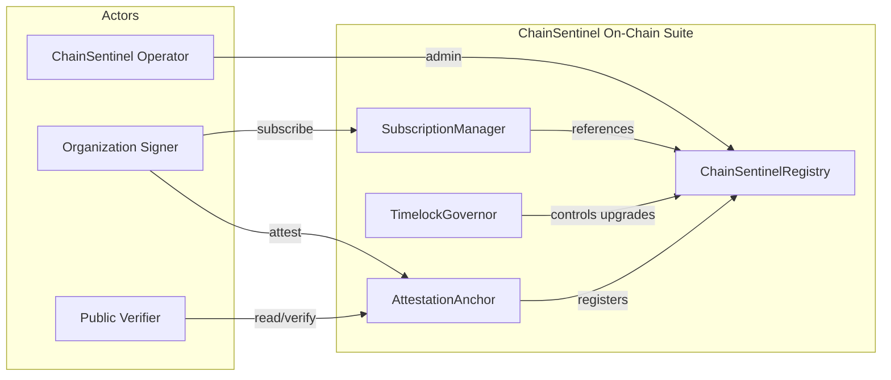
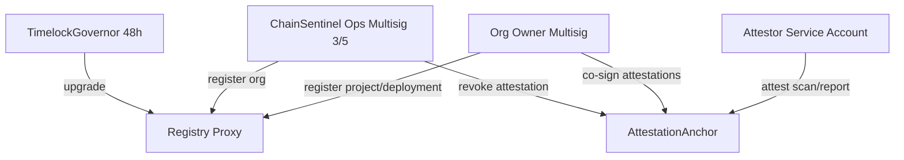

# 5. Smart Contract Architecture

**Document:** ChainSentinel On-Chain Components  
**Version:** 1.0.0  
**Target VM:** EVM (Solidity 0.8.24+)  
**Deployment Strategy:** Immutable core + upgradeable registry (UUPS proxy, audited)

---

## 5.1 Purpose & Scope

ChainSentinel's on-chain layer provides **tamper-evident anchoring** and **public verifiability** — not core business logic. Off-chain platform remains authoritative for analysis; contracts serve as:

1. **Attestation registry** — Content hashes of scans and reports anchored with metadata
2. **Organization registry** — Optional on-chain org/project identifiers for cross-protocol trust
3. **Subscription signals** — Optional payment/subscription state for decentralized billing (Phase 4+)

**Design philosophy (Trail of Bits / ConsenSys standard):** Minimal attack surface, no arbitrary execution, no custody of user funds beyond explicit subscription flows.

---

## 5.2 Contract Suite Overview



| Contract | Upgradeability | Purpose |
|----------|----------------|---------|
| `ChainSentinelRegistry` | UUPS (governed) | Canonical org/project/deployment IDs on-chain |
| `AttestationAnchor` | Immutable (or minimal proxy) | Store content hashes with signatures |
| `SubscriptionManager` | UUPS | Plan tier signals for protocol integrations |
| `TimelockGovernor` | Immutable | 48h timelock on registry upgrades |

---

## 5.3 ChainSentinelRegistry

### 5.3.1 Responsibilities

- Register **Organization IDs** (bytes32) mapped to metadata URI (IPFS/HTTPS)
- Register **Project IDs** under organizations
- Register **Deployment references** (chainId + address → projectId)
- Emit events for off-chain indexers

### 5.3.2 Key Data Structures

```
Organization {
  orgId: bytes32          // keccak256(org_slug) or assigned
  metadataURI: string     // IPFS CID or signed HTTPS URL
  owner: address          // Org admin EOA/multisig
  registeredAt: uint64
  active: bool
}

Project {
  projectId: bytes32
  orgId: bytes32
  metadataURI: string
}

DeploymentRef {
  chainId: uint256
  contractAddress: address
  projectId: bytes32
  registeredAt: uint64
}
```

### 5.3.3 Core Functions (Interface Level)

| Function | Access | Description |
|----------|--------|-------------|
| `registerOrganization(orgId, metadataURI, owner)` | Operator | Bootstrap org on-chain |
| `registerProject(orgId, projectId, metadataURI)` | Org owner | Create project |
| `registerDeployment(projectId, chainId, address)` | Org owner | Link contract to project |
| `updateMetadata(entityType, id, newURI)` | Entity owner | Update off-chain metadata pointer |
| `deactivateOrganization(orgId)` | Operator | Soft-disable (compliance) |

### 5.3.4 Events

```solidity
event OrganizationRegistered(bytes32 indexed orgId, address indexed owner, string metadataURI);
event ProjectRegistered(bytes32 indexed orgId, bytes32 indexed projectId, string metadataURI);
event DeploymentRegistered(bytes32 indexed projectId, uint256 chainId, address indexed contractAddress);
event MetadataUpdated(bytes32 indexed entityId, string newURI);
```

---

## 5.4 AttestationAnchor

### 5.4.1 Responsibilities

Anchor **content hashes** of security artifacts with cryptographic provenance:

- Scan result hashes (`content_hash` from scans table)
- Published report hashes (`content_hash` from reports table)
- Optional Merkle roots for batch attestations

### 5.4.2 Attestation Record

```
Attestation {
  attestationId: bytes32     // keccak256(deploymentRef, contentHash, nonce)
  projectId: bytes32
  chainId: uint256             // Chain where subject contract lives
  subjectAddress: address      // Contract being attested
  contentHash: bytes32         // SHA-256 as bytes32
  attestationType: enum        // SCAN | REPORT | MERKLE_ROOT
  schemaVersion: bytes4        // e.g. 0x00000001
  timestamp: uint64
  attestor: address            // ChainSentinel org signer or customer multisig
  revoked: bool
}
```

### 5.4.3 Verification Flow

```
1. Customer downloads report from ChainSentinel API
2. Computes SHA-256 of PDF bytes
3. Calls AttestationAnchor.getAttestation(attestationId) OR queries events
4. Compares on-chain contentHash with local hash
5. Verifies attestor is authorized signer in Registry
```

### 5.4.4 Core Functions

| Function | Access | Description |
|----------|--------|-------------|
| `attestScan(projectId, chainId, subject, contentHash, schemaVersion)` | Authorized attestor | Single scan attestation |
| `attestReport(projectId, contentHash, schemaVersion)` | Authorized attestor | Report attestation |
| `attestMerkleRoot(projectId, merkleRoot, leafCount)` | Authorized attestor | Batch anchor |
| `revokeAttestation(attestationId, reason)` | Operator | Compliance revocation |
| `isAuthorizedAttestor(address)` | View | Check signer allowlist |
| `getAttestation(attestationId)` | View | Read attestation |

### 5.4.5 Signature Scheme (Optional EIP-712)

Off-chain attestations may use **EIP-712 typed data** for gasless submission via relayer:

```
AttestationPayload {
  projectId, chainId, subjectAddress, contentHash,
  attestationType, schemaVersion, nonce, deadline
}
```

Relayer submits `attestWithSig(payload, signature)` — signature verified against Registry org owner or ChainSentinel attestor key.

---

## 5.5 SubscriptionManager (Phase 4+)

### 5.5.1 Purpose

Optional on-chain subscription signals for protocols that gate features by plan tier without trusting off-chain API alone.

### 5.5.2 Design

- Accepts stablecoin payments (USDC) or protocol token
- Maps `orgId → planTier → expiry`
- Emits `SubscriptionUpdated` events consumed by ChainSentinel billing sync worker
- **No fund custody beyond subscription period** — pull payments or prepaid credits

| Plan | On-Chain Signal | Capabilities Unlocked Off-Chain |
|------|-----------------|--------------------------------|
| Free | None / default | Basic scans, 5 deployments |
| Pro | `tier=1, expiry` | Monitoring, AI reports |
| Enterprise | `tier=2, expiry` | Custom rules, SLA, attestation |

---

## 5.6 Access Control Model



| Role | Permissions |
|------|-------------|
| **Governor (Timelock)** | Upgrade registry implementation |
| **Ops Multisig** | Register orgs, emergency pause, revoke attestations |
| **Org Owner** | Manage projects/deployments, co-sign customer attestations |
| **Attestor Service** | ChainSentinel-operated hot wallet (HSM) for automated attestation |
| **Public** | Read-only verification |

---

## 5.7 Security Properties

| Property | Mechanism |
|----------|-----------|
| **Immutability of history** | Attestations append-only; revocation flagged, not deleted |
| **No arbitrary calls** | No generic `call`/`delegatecall` in user-facing functions |
| **Upgrade safety** | UUPS + timelock + storage gap; Slither invariant tests |
| **Reentrancy** | Checks-Effects-Interactions; ReentrancyGuard on payment flows |
| **Pausability** | Circuit breaker on attestations (not reads) during incidents |
| **Address collision** | chainId always included in deployment keys |

---

## 5.8 Cross-Chain Strategy

**Phase 1:** Deploy `AttestationAnchor` on Ethereum mainnet + Sepolia testnet.  
**Phase 2:** L2 deployments (Arbitrum, Base) — same bytecode, chain-specific attestor keys.  
**Phase 3:** CCIP/LayerZero **read-only mirrors** of attestation events for unified verification (optional).

Attestation on Chain A does not require subject contract on Chain A — `subjectAddress` + `chainId` identify the deployment; attestation may live on a hub chain for cost efficiency.

---

## 5.9 Merkle Batch Attestations

For high-volume scan pipelines, batch hourly Merkle roots:

```
leaves = keccak256(abi.encode(attestationId, contentHash)) for each scan
root = MerkleRoot(leaves)
on-chain: attestMerkleRoot(projectId, root, leafCount)
off-chain: API serves Merkle proofs for individual verification
```

Reduces gas ~100x vs individual attestations.

---

## 5.10 Integration with Off-Chain Platform

| Off-Chain Event | On-Chain Action |
|-----------------|-----------------|
| Report published | Report Service calls attestor → `attestReport()` |
| Enterprise attestation requested | API POST `/reports/{id}/attest` → relayer tx |
| Org registered (enterprise) | Ops registers org in Registry |
| Deployment registered | Sync worker mirrors to Registry (optional) |

**Sync worker** (`packages/report-service/internal/attestation/`) listens to `cs.report.published.v1` and submits transactions via HSM-backed signer with nonce management and gas price oracles.

---

## 5.11 Audit & Testing Requirements

Before mainnet deployment:

- [ ] Full Slither + Mythril pass on all contracts
- [ ] Foundry invariant tests (attestation count monotonic, no unauthorized attestors)
- [ ] External audit (minimum one Tier-1 firm)
- [ ] Formal verification of access control (optional, recommended for AttestationAnchor)
- [ ] Deployment runbook with CREATE2 deterministic addresses across chains

---

## 5.12 Related Documents

- [API Endpoints](./04-api-endpoints.md) — `/reports/{id}/attest`
- [AI Report Generation](./07-ai-report-generation.md) — Content hash generation
- [Development Roadmap](./08-development-roadmap.md) — Contract deployment phases
