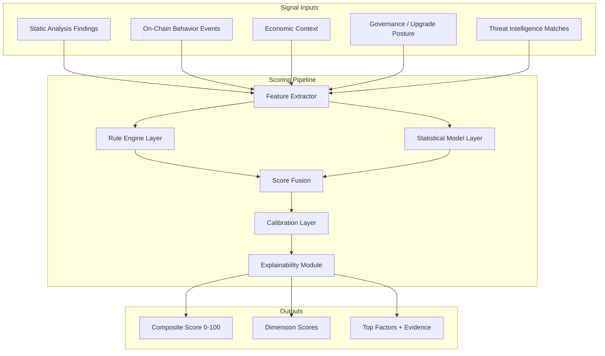
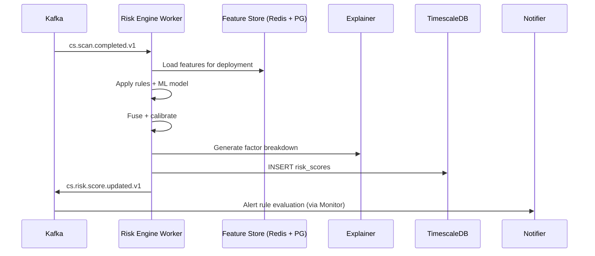

# 6. Risk Scoring Engine Design

**Document:** ChainSentinel Risk Quantification System  
**Version:** 1.0.0  
**Model Family:** `cs-risk-v2` (hybrid rules + statistical learning)

---

## 6.1 Objectives

The Risk Scoring Engine transforms heterogeneous security signals into a **single interpretable composite score (0–100)** with dimensional breakdowns. Design goals:

1. **Actionability** — Scores must drive alert thresholds and prioritization queues
2. **Explainability** — Every point of score attributable to named factors with evidence links
3. **Temporal sensitivity** — Scores update on new scans, chain events, and intel feed changes
4. **Calibration** — Scores correlate with historical exploit likelihood (backtested)
5. **Fair comparison** — Normalized across contract types, chains, and TVL tiers

---

## 6.2 Scoring Architecture



---

## 6.3 Scoring Dimensions

| Dimension | Weight (default) | Primary Inputs | Update Triggers |
|-----------|------------------|----------------|-----------------|
| **Static Analysis** | 30% | Open findings by severity, SWC categories, confidence | Scan complete, finding status change |
| **On-Chain Behavior** | 25% | Privileged calls, anomalous patterns, failed txs, flash loan adjacency | Real-time chain events |
| **Economic Exposure** | 20% | TVL, user count, asset volatility, concentration | Scheduled (hourly) + DeFi oracle feeds |
| **Governance & Upgrade** | 15% | Proxy pattern, admin type (EOA/MS/Timelock), upgrade history | Deployment metadata change, upgrade events |
| **Threat Intelligence** | 10% | Address/selector matches, CVE relevance, exploit similarity | Intel feed update |

Weights are **configurable per org tier** and **per project override** (enterprise).

---

## 6.4 Feature Extraction

### 6.4.1 Static Analysis Features

| Feature ID | Description | Type |
|------------|-------------|------|
| `open_critical_count` | Count of open critical findings | int |
| `open_high_count` | Count of open high findings | int |
| `swc_reentrancy_open` | Open reentrancy-class findings | bool |
| `swc_access_control_open` | Open access control findings | bool |
| `max_cvss_normalized` | Highest CVSS mapped from SWC/CWE | float |
| `finding_age_days_max` | Days since oldest open critical | int |
| `false_positive_rate_historical` | Org's FP rate for this deployment | float |

### 6.4.2 On-Chain Behavior Features

| Feature ID | Description | Type |
|------------|-------------|------|
| `privileged_calls_24h` | Owner/admin function invocations | int |
| `unknown_caller_ratio` | Calls from never-seen addresses / total | float |
| `large_value_transfers_24h` | Transfers > configurable threshold | int |
| `flash_loan_adjacent_txs` | Txs in same block as FL protocol | int |
| `failed_call_ratio_7d` | Reverted calls / total calls | float |
| `delegatecall_observed` | Delegatecall to non-self target | bool |

### 6.4.3 Economic Features

| Feature ID | Description | Type |
|------------|-------------|------|
| `tvl_usd_log` | log10(TVL + 1) | float |
| `unique_users_30d` | Distinct interacting addresses | int |
| `asset_volatility_30d` | Weighted volatility of held assets | float |
| `whale_concentration` | Top holder % of relevant token | float |

### 6.4.4 Governance Features

| Feature ID | Description | Type |
|------------|-------------|------|
| `is_proxy` | EIP-1967 or equivalent detected | bool |
| `admin_is_eoa` | Admin is single EOA | bool |
| `admin_is_timelock` | Admin behind timelock | bool |
| `upgrade_events_90d` | Implementation upgrades in window | int |
| `pause_function_present` | Contract has pause/emergency stop | bool |

### 6.4.5 Threat Intel Features

| Feature ID | Description | Type |
|------------|-------------|------|
| `intel_address_match` | Deployment or related address in blocklist | bool |
| `intel_selector_match` | Known malicious selector in ABI | bool |
| `cve_relevance_score` | Semantic match to active CVEs | float |
| `similar_exploit_pattern` | Graph similarity to past exploits | float |

---

## 6.5 Rule Engine Layer

Deterministic rules provide **baseline scores and hard floors/ceilings**.

### 6.5.1 Rule Format (YAML)

```yaml
rule_id: critical_open_floor
version: 1.0.0
dimension: static_analysis
priority: 100
condition:
  all:
    - feature: open_critical_count
      op: gte
      value: 1
action:
  type: floor
  score: 75.0
  factor:
    id: open_critical_findings
    label_template: "{open_critical_count} open critical finding(s)"
```

### 6.5.2 Rule Action Types

| Action | Effect |
|--------|--------|
| `floor` | Composite or dimension score cannot go below value |
| `ceiling` | Score cannot exceed value |
| `add` | Add fixed points to dimension |
| `multiply` | Multiply dimension by factor |
| `override` | Set dimension to exact value (rare, high priority) |

### 6.5.3 Example Hard Rules

| Rule | Condition | Effect |
|------|-----------|--------|
| Active exploit intel match | `intel_address_match = true` | Floor composite at 90 |
| Open critical + mainnet + TVL > $1M | compound | Floor at 85 |
| All findings mitigated + timelock admin | compound | Ceiling static at 20 |
| Verified audit + zero open high+ for 90d | compound | Reduce static by 15 pts |

Rules are version-controlled in `packages/risk-engine/rules/` and hot-reloaded with validation.

---

## 6.6 Statistical Model Layer

### 6.6.1 Model Purpose

The ML layer captures **non-linear interactions** rules miss (e.g., moderate findings + high TVL + EOA admin).

**Model type (v2):** Gradient boosted trees (XGBoost/LightGBM) trained on labeled dataset:

- **Positive class:** Contracts exploited within 90 days of snapshot
- **Negative class:** Matched controls (same category, no exploit)
- **Label source:** Rekt DB, Chainalysis incidents, internal curated set

### 6.6.2 Output

Model outputs ** exploit probability P ∈ [0, 1]** mapped to dimension contribution:

```
ml_risk_score = P * 100
```

### 6.6.3 Guardrails

- ML contribution capped at **40% of any single dimension**
- If model confidence low (feature coverage < 70%), fall back to rules-only
- Model version pinned per score record (`model_version` column)

---

## 6.7 Score Fusion

### 6.7.1 Dimension Score Calculation

For each dimension `d`:

```
dimension_score[d] = clamp(
  rule_score[d] * rule_weight + ml_score[d] * ml_weight,
  0, 100
)
```

Default: `rule_weight = 0.6`, `ml_weight = 0.4` (tunable per dimension).

### 6.7.2 Composite Score

```
composite = Σ (dimension_score[d] * dimension_weight[d])
```

### 6.7.3 Severity Bands

| Band | Score Range | Recommended Action |
|------|-------------|-------------------|
| **Critical** | 85 – 100 | Immediate escalation, pause consideration |
| **High** | 70 – 84.99 | Priority remediation within 48h |
| **Medium** | 45 – 69.99 | Scheduled remediation |
| **Low** | 20 – 44.99 | Monitor, backlog |
| **Minimal** | 0 – 19.99 | Routine monitoring |

---

## 6.8 Calibration

### 6.8.1 Platt Scaling / Isotonic Regression

Raw composite scores calibrated against historical exploit base rates:

```
Target: P(exploit | score ∈ [80,90)) ≈ 12% (example, empirically derived)
```

Recalibration quarterly with holdout validation.

### 6.8.2 Chain & Category Normalization

Z-score normalization within cohorts:

- Cohort key: `(chain_id, contract_category, tvl_tier)`
- Prevents DeFi lending protocols on L2 from unfairly compared to NFT contracts on L1

---

## 6.9 Explainability Module

Every score snapshot includes **top-N factors** (default N=5):

```json
{
  "top_factors": [
    {
      "id": "open_critical_findings",
      "dimension": "static_analysis",
      "contribution": 28.5,
      "direction": "increases_risk",
      "label": "1 open critical finding (SWC-107)",
      "evidence_refs": [
        { "type": "finding", "id": "uuid" }
      ],
      "rule_id": "critical_open_floor"
    },
    {
      "id": "admin_is_eoa",
      "dimension": "governance_upgrade",
      "contribution": 12.0,
      "direction": "increases_risk",
      "label": "Upgrade admin is a single EOA",
      "evidence_refs": [
        { "type": "deployment", "field": "proxy_admin" }
      ]
    }
  ]
}
```

**Shapley values** (SHAP) computed for ML contributions; rule contributions computed analytically.

---

## 6.10 Processing Pipeline



### Trigger Events

| Event | Priority | Debounce |
|-------|----------|----------|
| Scan completed | High | None |
| Finding status changed | High | 30s |
| Chain tx (privileged) | Critical | 5s |
| Intel feed updated | Medium | 5min batch |
| TVL refresh | Low | 1hr |

---

## 6.11 Feature Store

| Store | Contents | TTL |
|-------|----------|-----|
| **Redis** | Hot features for real-time scoring | 24h |
| **PostgreSQL** | Feature snapshots for audit/replay | 90 days |
| **S3** | Training datasets, model artifacts | Versioned |

Feature vector hash stored with each score for **reproducibility**.

---

## 6.12 Policy Integration (CI Gates)

Organizations define **risk policies** evaluated against scores and findings:

```yaml
policy_id: mainnet_deploy_gate
conditions:
  composite_score_max: 50
  open_critical_max: 0
  open_high_max: 2
action_on_fail: block_merge
```

Evaluated by API `/ci/scan/{id}/gate` — see [API Endpoints](./04-api-endpoints.md).

---

## 6.13 Model Governance

| Activity | Frequency | Owner |
|----------|-----------|-------|
| Training data refresh | Monthly | ML + Security Research |
| Model retrain | Quarterly | ML |
| Rule review | Bi-weekly | Security Engineering |
| Calibration validation | Quarterly | Security + Data |
| Backtest report | Per release | QA |

All model promotions require:
- AUC-ROC ≥ prior model on holdout
- No regression on known exploit cases (golden set)
- Sign-off from Security Lead

---

## 6.14 Anti-Gaming Considerations

| Attack | Mitigation |
|--------|------------|
| Marking findings false positive to lower score | FP rate tracked; suspicious bulk FP triggers audit |
| Score suppression via stale scans | Staleness penalty if no scan in 30 days |
| TVL manipulation | Use time-weighted TVL medians |
| Hiding proxy upgrades | Monitor implementation slot directly |

---

## 6.15 Related Documents

- [Database Schema](./03-database-schema.md) — `risk_scores` table
- [System Architecture](./02-system-architecture.md) — Event flow
- [AI Report Generation](./07-ai-report-generation.md) — Score narrative synthesis
