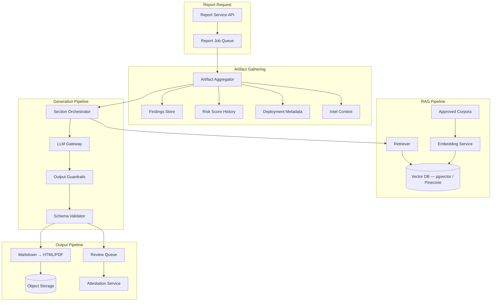
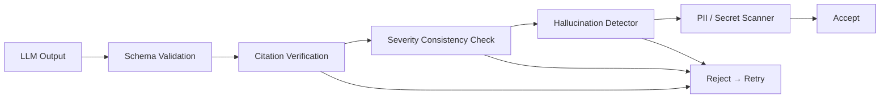

# 7. AI Report Generation Architecture

**Document:** ChainSentinel AI-Assisted Security Reporting  
**Version:** 1.0.0  
**Principle:** LLMs synthesize narrative; they do not invent findings

---

## 7.1 Design Philosophy

ChainSentinel's AI report pipeline follows the **verified synthesis** pattern used by leading security consultancies:

1. **Deterministic inputs only** — Findings, scores, and evidence are produced by analyzers and rule engines before any LLM invocation
2. **Grounded generation** — Retrieval-Augmented Generation (RAG) over approved corpora; citations required per claim
3. **Guardrailed outputs** — Schema validation, hallucination checks, severity consistency enforcement
4. **Human-in-the-loop** — Enterprise tier requires analyst review before publish
5. **Reproducibility** — Prompt templates versioned; full trace logged (redacted) for audit

**The LLM never:**
- Runs static analysis
- Accesses chain RPC directly
- Modifies finding severity without human action
- Generates findings not traceable to source artifacts

---

## 7.2 Architecture Overview



---

## 7.3 Report Types & Templates

| Template ID | Audience | Sections | AI Involvement |
|-------------|----------|----------|----------------|
| `audit_summary_v2` | Technical team | Executive summary, scope, methodology, findings table, recommendations | High |
| `risk_assessment_v2` | Risk/compliance | Risk overview, dimensional analysis, trend charts narrative, mitigation roadmap | High |
| `incident_v1` | Incident response | Timeline, impact, root cause, immediate actions | Medium (timeline from structured events) |
| `executive_v1` | C-suite | 1-page summary, business impact, top 3 risks | High ( constrained length) |
| `compliance_v1` | Regulators | Control mapping, evidence references | Low (mostly template) |

Templates defined as JSON in `packages/ai-pipeline/templates/`:

```json
{
  "template_id": "risk_assessment_v2",
  "version": "2.0.0",
  "sections": [
    {
      "key": "executive_summary",
      "max_tokens": 800,
      "required_citations": true,
      "generation_mode": "ai"
    },
    {
      "key": "findings_detail",
      "generation_mode": "hybrid",
      "description": "Template table + AI remediation narrative per finding"
    },
    {
      "key": "risk_dimensions",
      "generation_mode": "deterministic",
      "description": "Rendered from score JSON — no LLM"
    }
  ]
}
```

---

## 7.4 Artifact Aggregator

Before generation, the aggregator builds a **Report Context Package (RCP)** — immutable input bundle:

```
ReportContextPackage {
  report_id: UUID
  org_id, project_id
  scope: { deployment_ids[], date_range, scan_ids[] }
  deployments: [ DeploymentSnapshot ]
  findings: [ FindingSnapshot ]      // Only verified, in-scope
  risk_scores: [ ScoreSnapshot ]     // Current + trend points
  alerts: [ AlertSnapshot ]          // Optional, incident reports
  intel_context: [ IntelMatch ]
  aggregated_at: timestamp
  rcp_hash: SHA-256                  // Integrity check
}
```

Stored at `s3://cs-artifacts/{org_id}/reports/{report_id}/rcp.json`

**Finding inclusion rules:**
- Status ∈ `{open, acknowledged}` unless `include_resolved: true`
- Must belong to in-scope deployments
- Deduplicated by `fingerprint`

---

## 7.5 RAG Pipeline

### 7.5.1 Approved Corpora

| Corpus | Source | Update Cadence | Use |
|--------|--------|----------------|-----|
| **SWC Registry** | Smart Contract Weakness Classification | Static | Finding context |
| **CWE/CVE** | NIST NVD | Daily sync | Vulnerability references |
| **ConsenSys / Trail of Bits guides** | Licensed knowledge base | Manual | Remediation patterns |
| **Past reports (org)** | Customer's published reports | On publish | Consistency |
| **Protocol docs** | Customer-uploaded whitepapers | On upload | Protocol-specific context |
| **Exploit post-mortems** | Curated public incidents | Weekly | Pattern matching narrative |

**Explicitly excluded from RAG:** Unverified social media, unaudited forum posts, raw LLM-generated content.

### 7.5.2 Embedding & Retrieval

- **Embedding model:** `text-embedding-3-large` or self-hosted BGE-M3 (enterprise air-gap)
- **Chunk strategy:** 512-token chunks, 64-token overlap, metadata tags (swc_id, category)
- **Retrieval:** Hybrid search (BM25 + dense), top-k=10 per section, MMR diversification
- **Re-ranking:** Cross-encoder on top-10 → top-5 for prompt injection

### 7.5.3 Citation Format

Every AI-generated claim must include inline citation:

```
The reentrancy vulnerability identified in LendingPool.withdraw() [F:finding_uuid] 
follows the SWC-107 pattern [R:swc-107] and is exacerbated by the EOA admin key [F:governance_factor].
```

Post-generation validator parses `[F:...]`, `[R:...]` refs and verifies existence in RCP.

---

## 7.6 LLM Gateway

### 7.6.1 Provider Abstraction

```
LLMGateway
├── complete(prompt, options) → Completion
├── completeStructured(prompt, schema) → TypedObject
├── estimateTokens(text) → int
└── getModelVersion() → string
```

Supports: OpenAI, Anthropic, Azure OpenAI, self-hosted vLLM (enterprise).

### 7.6.2 Model Selection by Section

| Section | Model Tier | Rationale |
|---------|------------|-----------|
| Executive summary | High-capability | Nuance, brevity |
| Findings remediation | Standard | Structured output |
| Risk dimension narrative | Standard | Data-grounded |
| Compliance mapping | Standard + low temperature | Precision |

**Default temperature:** 0.2 (factual sections), 0.4 (executive summary)

### 7.6.3 Prompt Structure

```
[System]
You are ChainSentinel Report Generator. You ONLY use provided artifacts.
Never invent findings. Cite all claims. Use severity labels exactly as provided.

[Context — RCP excerpt]
{structured JSON of relevant findings, scores}

[Retrieved Knowledge]
{top-k RAG chunks with source IDs}

[Task]
Generate section: {section_key} following template constraints.
Max tokens: {max_tokens}. Required citation format: [F:id], [R:ref].

[Output Schema]
{JSON schema for structured sections}
```

Prompt templates versioned: `prompt_risk_assessment_v2_executive_summary@1.3.0`

---

## 7.7 Output Guardrails

### 7.7.1 Validation Pipeline



### 7.7.2 Guardrail Rules

| Check | Method | On Failure |
|-------|--------|------------|
| JSON schema compliance | JSON Schema validator | Retry with error feedback (max 2) |
| Citation existence | Parse refs, lookup RCP | Retry or flag for human |
| Severity mismatch | Compare mentioned severity vs finding record | Auto-correct or reject |
| New finding detection | NER + fuzzy match against RCP finding titles | Reject — hallucination |
| Overconfidence language | Regex + classifier ("definitely safe") | Soften or reject |
| Secret leakage | Entropy + pattern scan (private keys, API keys) | Redact + alert |

### 7.7.3 Hallucination Detector

Secondary LLM call (different model) as ** critic **:

```
Given SOURCE artifacts and GENERATED text, list any claims in GENERATED 
not supported by SOURCE. Output JSON array of unsupported_claims.
```

If `unsupported_claims.length > 0` → section regeneration with explicit exclusion list.

---

## 7.8 Section Orchestrator

Generation order respects dependencies:

```
1. risk_dimensions     (deterministic — no LLM)
2. findings_detail     (hybrid — template + AI remediation)
3. methodology         (template + minor AI polish)
4. executive_summary   (AI — depends on 1-3 outputs)
5. recommendations     (AI — depends on findings + scores)
6. appendix            (deterministic — raw tables)
```

Parallel generation where independent (findings_detail shards by severity group).

---

## 7.9 Human Review Workflow

### 7.9.1 States

```
generating → review (if require_human_review) → published
           → published (if auto_publish enabled, pro tier)
generating → failed
review → generating (regenerate section)
```

### 7.9.2 Review UI Capabilities

- Side-by-side: AI draft vs source finding
- Click citation → jump to evidence
- Edit section → sets `human_edited = true`
- Approve/reject per section or whole report
- Regenerate single section without full pipeline

### 7.9.3 Audit Trail

All edits logged in `audit_logs` with before/after markdown diff.

---

## 7.10 Rendering Pipeline

| Stage | Input | Output |
|-------|-------|--------|
| Compose | report_sections[] | Full Markdown document |
| Chart gen | risk_scores time-series | SVG/PNG embedded |
| HTML render | Markdown + CSS template | `report.html` |
| PDF render | HTML via headless Chromium | `report.pdf` |
| Hash | PDF bytes | SHA-256 → `content_hash` |

Branding: org logo, custom footer (enterprise).

---

## 7.11 Cost & Rate Management

| Control | Implementation |
|---------|----------------|
| Token budget per report | Hard cap by plan tier |
| Section-level budgets | Template `max_tokens` |
| Caching | Identical RCP hash → reuse deterministic sections |
| Queue priority | Enterprise > Pro > Free |
| Fallback | Template-only report if LLM unavailable |

---

## 7.12 Security & Privacy

| Concern | Mitigation |
|---------|------------|
| Prompt injection via finding text | Sanitize inputs; finding text treated as data, not instructions |
| Customer data in LLM logs | Enterprise: zero-retention API agreements; no training opt-out enforced |
| Cross-tenant leakage | RAG filtered by org_id; vector DB namespace isolation |
| Air-gap deployment | Self-hosted LLM + local vector DB (enterprise) |

**Prompt injection test suite** run on every pipeline release using adversarial finding descriptions.

---

## 7.13 Observability

| Metric | Target |
|--------|--------|
| Report generation p95 latency | < 5 min (standard), < 15 min (large) |
| Guardrail rejection rate | < 10% (monitor for prompt drift) |
| Citation verification pass rate | > 98% |
| Human edit rate | Track; high rate → prompt improvement |
| Customer satisfaction (CSAT) | > 4.2/5 on AI sections |

Logs: `report_id`, `section_key`, `model_version`, `prompt_version`, `token_count`, `latency_ms` — no raw customer source code in logs.

---

## 7.14 Integration with Attestation

On publish:

1. Compute `content_hash = SHA-256(pdf_bytes)`
2. Store in `reports.content_hash`
3. Optional: submit `attestReport(projectId, contentHash)` — see [Smart Contract Architecture](./05-smart-contract-architecture.md)
4. Include attestation tx link in report footer QR code

---

## 7.15 Related Documents

- [API Endpoints](./04-api-endpoints.md) — Report CRUD
- [Database Schema](./03-database-schema.md) — `reports`, `report_sections`
- [Development Roadmap](./08-development-roadmap.md) — AI phase delivery
