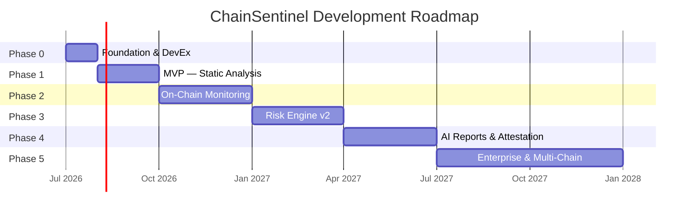
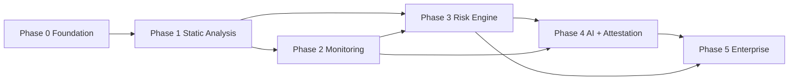

# 8. Development Roadmap

**Document:** ChainSentinel Delivery Plan  
**Version:** 1.0.0  
**Horizon:** 18 months (Q3 2026 – Q1 2028)  
**Methodology:** Phase-gated releases with security review checkpoints

---

## 8.1 Strategic Goals

| Goal | Success Metric |
|------|----------------|
| **MVP in market** | 10 design partners actively scanning within 90 days of Phase 1 GA |
| **Monitoring differentiation** | < 60s alert latency p95 on mainnet deployments |
| **Risk score trust** | Backtest AUC-ROC ≥ 0.75 on exploit prediction holdout |
| **AI report adoption** | 40% of Pro customers generate ≥ 1 report/month |
| **Enterprise readiness** | SOC 2 Type II, SSO, 99.9% API SLA |

---

## 8.2 Phase Overview

---

## 8.3 Phase 0 — Foundation (Weeks 1–6)

**Objective:** Establish monorepo, CI/CD, core infrastructure, and development environment.

### Deliverables

| Item | Owner | Exit Criteria |
|------|-------|---------------|
| Monorepo scaffold | Platform | All packages build; lint/test in CI |
| Docker Compose dev stack | Platform | New dev onboarded in < 30 min |
| PostgreSQL schema v1 | Backend | Migrations run; RLS policies tested |
| API Gateway skeleton | Backend | `/health`, `/ready`, OpenAPI stub |
| Auth service (local JWT + API keys) | Backend | Org/user CRUD; key issuance |
| Event bus (NATS dev / Kafka staging) | Platform | Topic schema registry |
| Observability baseline | Platform | Structured logs, Prometheus metrics |
| ADR process | Architecture | `docs/adr/` with first 3 ADRs |

### Team Focus

- 2 backend engineers
- 1 platform/DevOps engineer
- 1 security engineer (part-time, architecture review)

### Risks

| Risk | Mitigation |
|------|------------|
| Over-engineering monorepo | Strict MVP scope; defer GraphQL, multi-region |

---

## 8.4 Phase 1 — MVP: Static Analysis (Weeks 7–16)

**Objective:** Ship scan-triggered static analysis with finding management and CI integration.

### Features

- [ ] Project & deployment CRUD
- [ ] Slither adapter (primary analyzer)
- [ ] Custom ChainSentinel rule pack (10 high-value rules)
- [ ] Finding normalization & deduplication
- [ ] Scan job queue with sandbox execution
- [ ] Finding list/filter API
- [ ] Finding status workflow (open → mitigated / false positive)
- [ ] CI gate endpoint (`/ci/scan`, `/ci/scan/{id}/gate`)
- [ ] GitHub Action template
- [ ] Basic dashboard (project summary, finding table)
- [ ] Email notifications for scan complete

### Technical Milestones

| Milestone | Date Target |
|-----------|-------------|
| First successful Slither scan E2E | Week 9 |
| API freeze for Phase 1 | Week 12 |
| Private beta (5 design partners) | Week 14 |
| Phase 1 GA | Week 16 |

### Success Criteria

- Scan success rate > 95% on design partner repos
- Finding fingerprint dedup accuracy > 90% vs manual review
- API p99 latency < 500ms (excl. scan execution)

### Out of Scope (Deferred)

- On-chain monitoring
- Risk scoring (placeholder static severity counts only)
- AI reports
- On-chain attestation

---

## 8.5 Phase 2 — On-Chain Monitoring (Weeks 17–28)

**Objective:** Real-time chain ingestion, behavioral alerts, and intel enrichment.

### Features

- [ ] EVM block listener (Ethereum mainnet + Sepolia)
- [ ] Transaction decoder with ABI registry
- [ ] Event log indexer
- [ ] Monitor service with alert rule engine
- [ ] Alert rules CRUD + evaluation
- [ ] Slack & webhook notifications
- [ ] Intel service v1 (OFAC + internal blocklist)
- [ ] SSE alert stream
- [ ] L2 expansion: Arbitrum, Base
- [ ] Proxy / upgrade detection worker
- [ ] Dashboard: alert timeline, chain activity feed

### Technical Milestones

| Milestone | Date Target |
|-----------|-------------|
| Mainnet ingestion caught up < 3 blocks | Week 20 |
| First privileged-call alert E2E | Week 22 |
| Intel enrichment live | Week 24 |
| Phase 2 GA | Week 28 |

### Success Criteria

- Alert delivery p95 < 60s from chain event
- False positive rate < 15% on default rule set (design partner feedback)
- RPC failover with zero data loss (at-least-once processing)

### Infrastructure

- Dedicated ingestion worker pool (partitioned by chain_id)
- Redis for alert dedup state
- TimescaleDB enabled for chain event metrics

---

## 8.6 Phase 3 — Risk Engine v2 (Weeks 29–40)

**Objective:** Production-grade composite risk scoring with explainability.

### Features

- [ ] Feature extractor (all 5 dimensions, rules-only mode)
- [ ] Rule engine with YAML hot-reload
- [ ] Risk score API (`/risk`, `/risk/history`, `/risk/explain`)
- [ ] Score update on scan + chain + intel events
- [ ] ML model v2 training pipeline
- [ ] Calibration layer + severity bands
- [ ] SHAP explainability for ML contributions
- [ ] Project risk summary dashboard
- [ ] Risk-based alert rules
- [ ] Mythril adapter + second analyzer
- [ ] Elasticsearch finding search

### Technical Milestones

| Milestone | Date Target |
|-----------|-------------|
| Rules-only scoring GA | Week 32 |
| ML model backtest AUC ≥ 0.75 | Week 36 |
| Full hybrid scoring GA | Week 40 |

### Success Criteria

- Score reproducibility: same RCP → identical score (deterministic path)
- Explain endpoint returns ≥ 3 factors for 95% of deployments
- Design partners validate score ranking vs manual assessment (Spearman ρ > 0.6)

### Research Track (Parallel)

- Exploit dataset curation (500+ labeled snapshots)
- Quarterly model retrain automation

---

## 8.7 Phase 4 — AI Reports & Attestation (Weeks 41–52)

**Objective:** AI-assisted report generation with guardrails and optional on-chain anchoring.

### Features

- [ ] Report service with job queue
- [ ] Artifact aggregator (RCP builder)
- [ ] RAG pipeline (SWC, CWE, remediation guides)
- [ ] Template: `risk_assessment_v2`, `audit_summary_v2`
- [ ] LLM gateway (OpenAI + Anthropic)
- [ ] Output guardrails (citation, hallucination, schema)
- [ ] PDF/HTML rendering
- [ ] Human review workflow
- [ ] Report publish + download API
- [ ] `AttestationAnchor` contract (Sepolia → mainnet)
- [ ] Report attestation API + relayer service
- [ ] Merkle batch attestation (optional optimization)

### Technical Milestones

| Milestone | Date Target |
|-----------|-------------|
| Template-only reports (no AI) | Week 43 |
| AI sections with guardrails beta | Week 46 |
| Sepolia attestation E2E | Week 48 |
| Phase 4 GA | Week 52 |

### Success Criteria

- Citation verification pass rate > 98%
- Human edit rate < 30% (indicates good first drafts)
- Report generation p95 < 5 min (standard scope)
- External smart contract audit complete before mainnet attestation

### Compliance

- LLM data processing agreement templates for enterprise
- AI-generated content disclaimer in all reports

---

## 8.8 Phase 5 — Enterprise & Multi-Chain (Weeks 53–72)

**Objective:** Enterprise-grade features, compliance certifications, and chain expansion.

### Features

- [ ] SSO (OIDC + SAML)
- [ ] Advanced RBAC (custom roles)
- [ ] SOC 2 Type II audit completion
- [ ] Multi-region deployment (DR region)
- [ ] Air-gap / self-hosted LLM option
- [ ] `ChainSentinelRegistry` on mainnet
- [ ] SubscriptionManager (optional on-chain billing sync)
- [ ] Solana adapter (read-only monitoring)
- [ ] GraphQL read API
- [ ] Custom analyzer plugin SDK
- [ ] White-label reports
- [ ] 99.9% SLA + status page
- [ ] WORM audit log storage tier

### Technical Milestones

| Milestone | Date Target |
|-----------|-------------|
| SSO GA | Week 56 |
| SOC 2 observation period start | Week 58 |
| Solana monitoring beta | Week 64 |
| Phase 5 GA | Week 72 |

### Success Criteria

- 3 enterprise contracts signed
- API availability 99.9% measured over 90 days
- SOC 2 Type II report issued

---

## 8.9 Cross-Phase Engineering Standards

### Security Review Gates

Every phase requires sign-off before GA:

| Gate | Reviewer |
|------|----------|
| Threat model update | Security Architect |
| Penetration test (API + auth) | External firm (Phase 1, 3, 5) |
| Analyzer sandbox escape test | Security Engineering |
| Smart contract audit | External firm (Phase 4+) |
| AI red team (prompt injection) | Security + ML (Phase 4+) |

### Release Cadence

- **Sprints:** 2 weeks
- **Minor releases:** Every 2 sprints (feature flags for incomplete work)
- **Patch releases:** As needed (security patches within 24h critical)

### Quality Targets (All Phases)

| Metric | Target |
|--------|--------|
| Unit test coverage (core services) | ≥ 80% |
| Integration test pass rate | 100% on main branch |
| API breaking changes | Zero within major version |
| Documentation | OpenAPI + architecture docs updated per release |

---

## 8.10 Team Scaling Plan

| Phase | Engineering Headcount | Key Hires |
|-------|----------------------|-----------|
| 0–1 | 4–5 | Backend, platform |
| 2 | 6–7 | Blockchain indexing specialist |
| 3 | 8–9 | ML engineer, security researcher |
| 4 | 10–12 | ML/AI engineer, technical writer |
| 5 | 14–16 | Enterprise SRE, compliance engineer |

---

## 8.11 Dependency Map

**Critical path:** P0 → P1 → P2 → P3 → P4 → P5

**Parallelizable:** Intel service (P2), Elasticsearch (P3), dashboard UI (all phases)

---

## 8.12 MVP Definition (Phase 1 GA)

Minimum viable product checklist for public launch:

- [ ] User can create project and register EVM deployment
- [ ] User can trigger static scan from git source
- [ ] User can view normalized findings with severity
- [ ] User can update finding status with audit trail
- [ ] User can configure CI gate blocking on critical findings
- [ ] User receives email on scan completion
- [ ] API documented in OpenAPI with authentication
- [ ] 99.5% API uptime for 30-day beta period

---

## 8.13 Open Decisions (ADRs Required)

| ID | Decision | Target Phase | Options |
|----|----------|--------------|---------|
| ADR-004 | Primary language for backend services | 0 | Go, Rust, TypeScript |
| ADR-005 | Kafka vs NATS production | 0 | Kafka (scale) vs NATS (simplicity) |
| ADR-006 | Vector DB for RAG | 4 | pgvector vs Pinecone vs Weaviate |
| ADR-007 | Dashboard framework | 1 | React + internal vs Retool MVP |
| ADR-008 | Multi-region strategy | 5 | Active-passive vs active-active |

---

## 8.14 Related Documents

- [Folder Structure](./01-folder-structure.md) — Repository layout per phase
- [System Architecture](./02-system-architecture.md) — Component dependencies
- [README](./README.md) — Documentation index

---

## 8.15 Revision & Review Cadence

| Activity | Frequency |
|----------|-----------|
| Roadmap review with stakeholders | Monthly |
| Phase gate go/no-go | End of each phase |
| Risk register update | Bi-weekly |
| Capacity vs scope rebaseline | Quarterly |

**Next review date:** 2026-07-01
