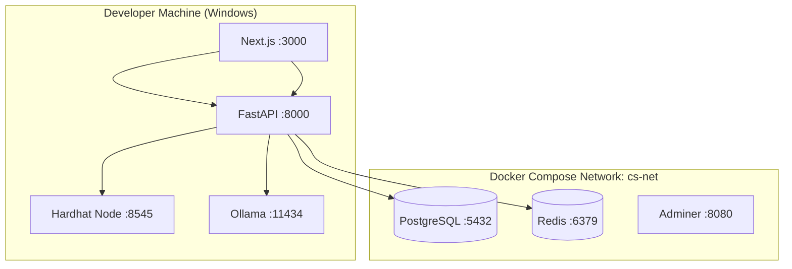

# ChainSentinel Docker Architecture

**Version:** 1.0.0  
**Purpose:** Local development infrastructure topology

---

## 1. Design Decision

**Why Docker Compose for local dev?**

- PostgreSQL, Redis, and Ollama run identically on every developer machine
- No native PostgreSQL install conflicts on Windows
- Matches production-like service boundaries without Kubernetes overhead
- One command (`docker compose up`) bootstraps the data layer

**Why not containerize frontend/backend in dev (Phase 1)?**

- Hot reload is faster running natively on Windows
- Debugging in Cursor is simpler with local Node/Python processes
- Docker is reserved for **stateful services** and CI integration tests

---

## 2. Service Topology



---

## 3. Services

| Service | Image | Port | Purpose |
|---------|-------|------|---------|
| **postgres** | `postgres:16-alpine` | 5432 | Primary database |
| **redis** | `redis:7-alpine` | 6379 | Cache, sessions (Phase 2) |
| **adminer** | `adminer:4` | 8080 | DB admin UI (dev only) |

**Ollama runs natively on Windows** (not in Docker) for GPU/CPU access without VM overhead on integrated graphics.

---

## 4. Volumes

| Volume | Mount | Retention |
|--------|-------|-----------|
| `cs_postgres_data` | `/var/lib/postgresql/data` | Persists across restarts |
| `cs_redis_data` | `/data` | Persists cache (optional flush) |

---

## 5. Network

- **Network name:** `cs-net` (bridge)
- All containers resolve each other by service name
- Host apps connect via `localhost:{port}`

---

## 6. Environment Flow

```
.env (root)
  ├── POSTGRES_* → docker-compose.yml → postgres container
  ├── DATABASE_URL → backend/.env → FastAPI SQLAlchemy
  └── REDIS_URL → backend/.env → FastAPI cache
```

---

## 7. Commands

```powershell
# Start all infrastructure
docker compose -f docker/docker-compose.yml up -d

# View logs
docker compose -f docker/docker-compose.yml logs -f postgres

# Stop (keep data)
docker compose -f docker/docker-compose.yml down

# Stop and destroy volumes (reset DB)
docker compose -f docker/docker-compose.yml down -v

# Health check
docker compose -f docker/docker-compose.yml ps
```

---

## 8. CI/CD Docker Usage

In GitHub Actions:

- Spin up `postgres:16-alpine` and `redis:7-alpine` as **service containers**
- Run backend tests against ephemeral DB
- Run `forge test` and `hardhat test` in CI runners (no Docker needed for Foundry)

See [GitHub Actions CI/CD](./11-github-actions-cicd.md).

---

## 9. Production Path (Future)

| Environment | Orchestration |
|-------------|---------------|
| Staging | Docker Compose on VPS or ECS |
| Production | Kubernetes (EKS/GKE) with managed RDS |

Local Compose is **not** production-ready without hardening (TLS, secrets manager, resource limits).

---

## 10. Resource Limits (Recommended)

Add to `docker-compose.yml` for 16 GB RAM machines:

```yaml
deploy:
  resources:
    limits:
      memory: 512M   # postgres
      cpus: "1.0"
```

Prevents Docker from starving Ollama and IDE.

---

## 11. Related Files

- `docker/docker-compose.yml` — Main compose file
- `docker/docker-compose.dev.yml` — Dev overrides
- `database/init.sql` — First-boot schema bootstrap
