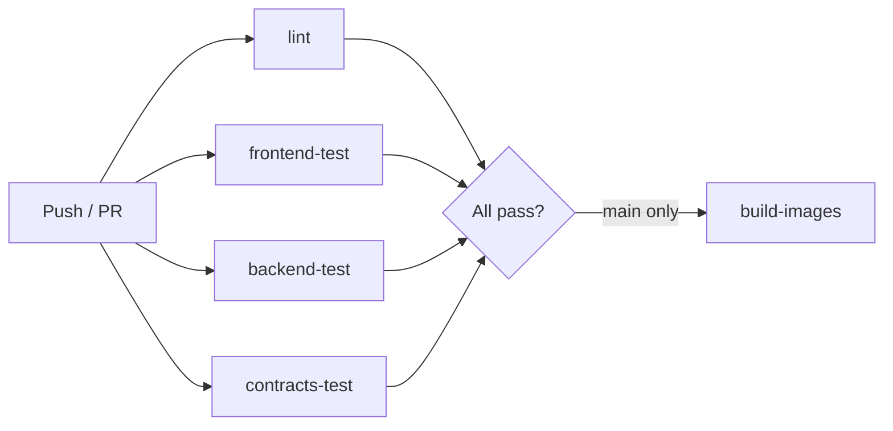

# ChainSentinel — GitHub Actions CI/CD Recommendations

**Version:** 1.0.0  
**Status:** Recommended pipeline design (workflow file in `.github/workflows/ci.yml`)

---

## 1. Pipeline Philosophy

1. **Fast feedback** — Lint and unit tests complete in < 5 minutes
2. **Parallel jobs** — Frontend, backend, and contracts test independently
3. **No secrets in forks** — PRs from forks skip deploy steps
4. **Deterministic contracts** — Foundry + Hardhat tests on every push
5. **Security gates** — Dependency audit, Slither (Phase 2), secret scanning

---

## 2. Workflow Triggers

| Event | Branches | Actions |
|-------|----------|---------|
| `push` | `main`, `develop` | Full CI |
| `pull_request` | `main`, `develop` | Full CI (no deploy) |
| `workflow_dispatch` | any | Manual re-run |

---

## 3. Job Architecture



---

## 4. Job Specifications

### 4.1 `lint` (2 min)

- **Runs on:** `ubuntu-latest`
- **Steps:**
  - Checkout
  - Prettier check (frontend)
  - ESLint (frontend)
  - Ruff check + format (backend)
  - `forge fmt --check` (contracts)

### 4.2 `frontend-test` (4 min)

- **Matrix:** Node 20, Node 22
- **Steps:**
  - `npm ci`
  - `npm run typecheck`
  - `npm run lint`
  - `npm run test` (when tests exist)
  - `npm run build`

### 4.3 `backend-test` (5 min)

- **Services:** `postgres:16-alpine`, `redis:7-alpine`
- **Steps:**
  - Setup Python 3.12
  - `pip install -r requirements-dev.txt`
  - Alembic migrate (test DB)
  - `pytest --cov=app`

### 4.4 `contracts-test` (4 min)

- **Steps:**
  - Setup Node 22
  - `npm ci` in contracts/
  - `npx hardhat test`
  - Install Foundry (`foundry-rs/foundry-toolchain@v1`)
  - `forge test -vv`

### 4.5 `security-audit` (Phase 2)

- `npm audit --audit-level=high`
- `pip-audit`
- Slither on contracts (optional, allow failure initially)

### 4.6 `docker-build` (main branch only)

- Build backend Docker image
- Push to GHCR (`ghcr.io/org/chainsentinel-api`)
- Tag: `sha-{short}`, `latest`

---

## 5. Caching Strategy

```yaml
- uses: actions/cache@v4
  with:
    path: |
      frontend/node_modules
      ~/.npm
    key: node-${{ hashFiles('frontend/package-lock.json') }}
```

Separate caches for Python (`~/.cache/pip`) and Foundry (`~/.foundry`).

---

## 6. Required Secrets

| Secret | Used By | Purpose |
|--------|---------|---------|
| `GITHUB_TOKEN` | All | Default (packages, checkout) |
| `CODECOV_TOKEN` | backend-test | Coverage upload (optional) |
| `DOCKER_REGISTRY_TOKEN` | docker-build | GHCR push |

**Never store:** private keys, production DB URLs, API keys in GitHub secrets for CI.

---

## 7. Branch Protection (Recommended)

Configure on `main`:

- [ ] Require PR before merge
- [ ] Require status checks: `lint`, `frontend-test`, `backend-test`, `contracts-test`
- [ ] Require linear history (optional)
- [ ] Require signed commits (optional, enterprise)

---

## 8. Deployment Stages (Future)

| Stage | Trigger | Target |
|-------|---------|--------|
| **Preview** | PR opened | Vercel preview (frontend) |
| **Staging** | merge to `develop` | Staging ECS/Compose |
| **Production** | tag `v*` | Production K8s |

Use GitHub Environments with approval gates for production.

---

## 9. Local CI Parity

Run the same checks locally before push:

```powershell
.\scripts\verify-environment.ps1
.\scripts\run-ci-local.ps1   # create when implementing
```

---

## 10. Workflow File Location

Implementation: [`.github/workflows/ci.yml`](../.github/workflows/ci.yml)

This document describes **intent**; update both when changing pipeline behavior.
